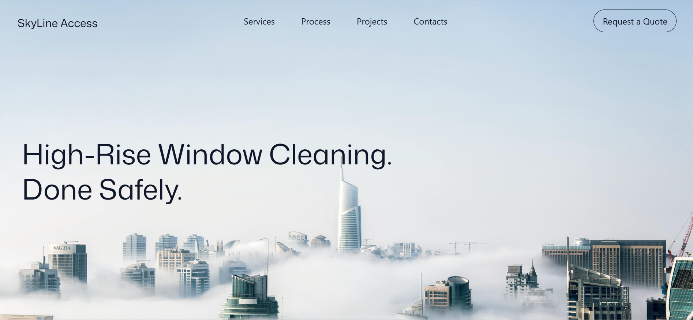

# SkyAccess

SkyAccess is a responsive, scroll-animated landing page for a high-rise window cleaning service. It uses GSAP for motion, Tailwind CSS for styling, and a multi-step quote form to capture leads.

## View Live Site
- https://sky-access-site.vercel.app/



## Features
- Hero split-text reveal and scroll-driven image zoom
- Sticky, horizontal service cards with animated section divider
- Pinned process timeline with step animations
- Multi-step quote form with a confirmation state
- Global footer with locations and contact details

## Tech Stack
- React + Vite
- Tailwind CSS
- GSAP + ScrollTrigger

## Getting Started
1. Install dependencies:
   ```bash
   npm install
   ```
2. Start the dev server:
   ```bash
   npm run dev
   ```

## Scripts
- `npm run dev` - Start the Vite dev server
- `npm run build` - Build for production
- `npm run preview` - Preview the production build
- `npm run lint` - Run ESLint

## Project Structure
- `src/App.jsx` - App composition
- `src/components/` - Page sections and forms
- `src/index.css` - Global styles and Tailwind layers
- `constants/index.js` - Navigation, services, and process data
- `public/images/` - Hero and service imagery

## Customization
- Update copy and services in `constants/index.js`
- Swap images in `public/images/`
- Adjust animation timings in `src/components/`
